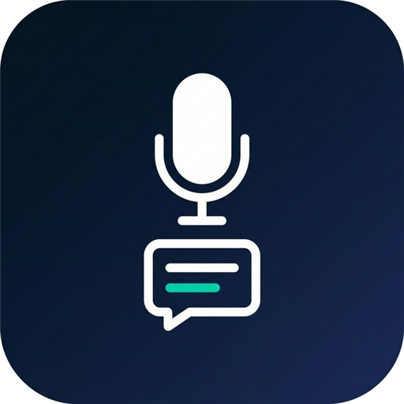
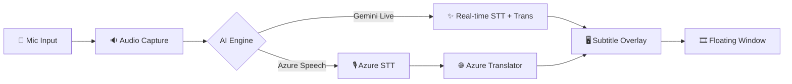

  

# 🎙️ LiveTranslate: Real-Time Speech Translation Overlay

  
   
  <strong>🌐 Official Website:</strong> <a href="https://livetranslate-ai.netlify.app/">livetranslate-ai.netlify.app</a>

 

**LiveTranslate** is a low-latency, real-time speech translation subtitle overlay for Windows. It captures your microphone audio, transcribes it using state-of-the-art AI, and provides instant translation in a sleek, semi-transparent floating window.

---

## 📺 Demo & Website

### The Application Overlay

### The Official Website

---

## ✨ Key Features

-   **🚀 Near-Instant Translation**: Leverages **Google Gemini 2.0 Flash** or **Azure Speech Services** for real-time performance.
-   **🖥️ Non-Intrusive UI**:
    -   Semi-transparent overlay stays on top of meetings, videos, or games.
    -   Fully draggable and resizable (via settings).
    -   Interactive toggle: Double-click to instantly hide/show text.
-   **⌨️ Global Hotkey**: `Ctrl+Shift+L` to toggle listening from any application.
-   **📥 Tray-Based**: Operates entirely from the system tray for a clean, taskbar-free workspace.
-   **🎨 Customizable**: Change font size, colors, and window opacity to match your preference.

---

## 🛠️ How It Works

LiveTranslate uses a modular pipeline to ensure the lowest possible latency between speech and subtitle display.

### The Pipeline:
1.  **Capture**: `PyAudio` captures raw 16kHz audio in 100ms chunks.
2.  **Processing**: 
    - **Google Gemini**: Uses the Gemini 2.0 Flash Live API (WebSocket) for simultaneous transcription and translation (lowest latency).
    - **Azure**: Uses Azure Cognitive Services for high-fidelity speech-to-text followed by neural translation.
3.  **Display**: A custom `PyQt5` window renders text with semi-transparency and "stay-on-top" priority.

---

## 📥 Download & Quick Start

We provide two ways to run the application for Windows:

### Option 1: Fast Installer (Recommended 🚀)
1. **Download the Installer**: Go to the [**GitHub Releases page**](https://github.com/kotobuki09/LiveTranslate/releases) and download `LiveTranslate_Setup.exe`.
2. **Install**: Double-click the Setup file. It installs the backend dependencies and creates a fast-launching Desktop shortcut.
3. **Launch**: Open LiveTranslate from your Desktop or Start Menu.

### Option 2: Portable Executable (Standalone)
1. **Download the Executable**: Download `LiveTranslate.exe` from the Releases page.
2. **Place the file** anywhere you like (Desktop, `C:\Tools\`, etc.).
3. **Launch**: Double-click it. *(Note: The standalone executable takes ~10-15 seconds to open as it must decompress itself in the background).*

### Quick Start
4. **Configure (Optional)**: Right-click the **LT** icon in the system tray → **Settings** to enter your own API keys.
5. **Start**: Right-click the tray icon → **Start Listening**.

> [!WARNING]
> **Windows SmartScreen Warning — this is expected and safe to bypass.**
>
> Because `LiveTranslate.exe` is an **unsigned** open-source executable, Windows will show a blue *"Windows protected your PC"* dialog the first time you run it. Here's how to proceed:
>
> 1. Click **"More info"** (small link below the warning text)
> 2. Click **"Run anyway"**
>
> This warning appears for all community-built executables that have not been commercially signed. You can review the full source code in this repository.

> [!NOTE]
> **No API Keys Required:** The application now comes embedded with default public API keys so you can test it immediately!
> 
> However, for long-term use, you should add your own private keys in the **Settings** menu. You can enter at least one of:
> - **Azure Speech key** — for Azure engine (requires Azure account)
> - **Gemini API key** — for Gemini engine ([free tier available](https://aistudio.google.com/))
>
> Settings are saved locally in `config.json` next to the `.exe` (or in `%APPDATA%\LiveTranslate\` if the exe is in a restricted folder).
---

## ⚙️ Settings & Personalization

LiveTranslate is designed for **personal use**, meaning you use your own AI provider keys. This ensures your data remains under your control and you only pay for what you use (often within free tiers!).

### 🔑 Personal API Keys
Right-click the tray icon -> **Settings** to configure:

*   **Google Gemini** (Recommended for lowest latency):
    *   Get a free key at [Google AI Studio](https://aistudio.google.com/).
    *   Uses the `Gemini 2.0 Flash` model for real-time speech-to-speech.
*   **Azure Cognitive Services**:
    *   Get keys at the [Azure Portal](https://portal.azure.com/).
    *   Requires **Speech Service** (for STT) and **Translator Service** (for translation).

> [!NOTE]
> Your keys are stored **locally** in `config.json`. They are never uploaded or shared.

### 🌐 Language Presets
LiveTranslate supports several bi-directional language presets out of the box:

-   **EN ↔ VI**: English and Vietnamese (Default)
-   **EN ↔ ZH**: English and Chinese (Simplified)
-   **EN ↔ JA**: English and Japanese
-   **EN ↔ KO**: English and Korean
-   **EN ↔ FR**: English and French
-   **EN ↔ IT**: English and Italian

You can switch between these presets instantly via the **Settings** window.

---

## 🧪 Technology Stack

-   **Frontend**: `PyQt5` for the high-performance transparent overlay and system tray management.
-   **Audio**: `PyAudio` for low-level microphone stream handling.
-   **AI Engines**:
    -   `google-genai`: WebSocket-based interaction with the Gemini Live API.
    -   `azure-cognitiveservices-speech`: Official SDK for Azure Speech-to-Text.
-   **Utilities**: `pystray` (tray icon), `keyboard` (global hotkeys), `python-dotenv` (config).

---

## 🛡️ Security & Privacy

-   **Local Processing**: Audio is streamed directly from your device to the AI provider. No data is stored on our servers.
-   **Secret Management**: Your API keys are stored locally in `config.json` and are never shared or uploaded.
-   **Open Source**: Audit the code yourself to see exactly how your data is handled.

---

## 📐 Promotion & Branding

Check out the [plan/](plan/) folder for high-resolution logos, marketing copy, and screenshots to help spread the word!

---

## 🤝 Contributing

Contributions are what make the open source community such an amazing place to learn, inspire, and create. Please see [CONTRIBUTING.md](CONTRIBUTING.md) for details.

---

## 📄 License

Distributed under the MIT License. See [LICENSE](LICENSE) for more information.

---

## 👨‍💼 Author

<table>
  <tr>
    <td>
      
    </td>
    <td>
      <strong>NGÔ TRUNG KIÊN</strong> 
      🌐 <a href="https://kngo.netlify.app/">kngo.netlify.app</a> 
    </td>
  </tr>
</table>

---
