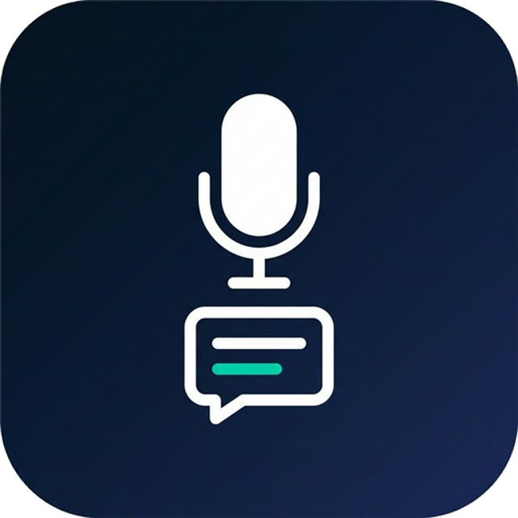
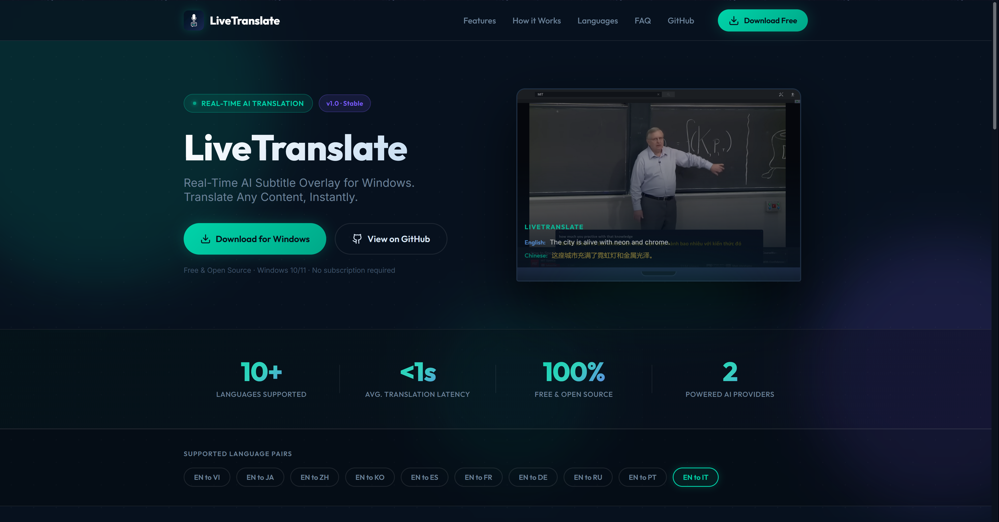
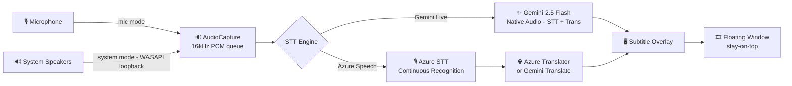

<p align="center">
  
</p>

# 🎙️ LiveTranslate: Real-Time Speech Translation Overlay

[](https://opensource.org/licenses/MIT)
[](https://www.python.org/downloads/release/python-3120/)
[](CONTRIBUTING.md)
[](https://github.com/kotobuki09/LiveTranslate/graphs/commit-activity)

<div align="center">
  <a href="https://www.producthunt.com/products/livetranslate?launch=livetranslate" target="_blank">
    
  </a>
  <br>
  <strong>🌐 Official Website:</strong> <a href="https://livetranslate-ai.netlify.app/">livetranslate-ai.netlify.app</a>
</div>
<br>

**LiveTranslate** is a low-latency, real-time speech translation subtitle overlay for Windows. It captures audio from your **microphone or system speakers**, transcribes it using state-of-the-art AI, and provides instant translation in a sleek, semi-transparent floating window.

---

## 📺 Demo & Website

### 🎬 Watch the Demo Video

<div align="center">
  <a href="https://youtu.be/kMhO4E2Rj5Y" target="_blank">
    
  </a>
  <br><br>
  <a href="https://youtu.be/kMhO4E2Rj5Y">▶️ Watch the Full Demo on YouTube</a>
</div>

### The Official Website


---

## ✨ Key Features

-   **🚀 Near-Instant Translation**: Leverages **Google Gemini 2.5 Flash** or **Azure Speech Services** for real-time performance.
-   **🎙️ Dual Audio Source**:
    -   **Microphone mode** (default): Captures your voice via any input device.
    -   **System Audio mode**: Captures all desktop/speaker output via WASAPI loopback — perfect for translating videos, calls, or games without a headset.
-   **🖥️ Non-Intrusive UI**:
    -   Semi-transparent overlay stays on top of meetings, videos, or games.
    -   Fully draggable and resizable (via settings).
    -   Interactive toggle: Double-click to instantly hide/show text.
    -   Status badge in the subtitle bar shows the active audio source (🎙 or 🔊).
-   **⌨️ Global Hotkey**: `Ctrl+Shift+L` to toggle listening from any application.
-   **📥 Tray-Based**: Operates entirely from the system tray for a clean, taskbar-free workspace.
-   **🎨 Customizable**: Change font size, colors, window opacity, and quality mode to match your preference.

---

## 🛠️ How It Works

LiveTranslate uses a modular pipeline to ensure the lowest possible latency between speech and subtitle display.



### The Pipeline:
1.  **Capture** (`audio_capture.py`): `PyAudioWPatch` captures raw 16kHz PCM in 100ms chunks using one of two modes:
    -   **`mic`** (default): Reads from a selected microphone input device.
    -   **`system`**: Opens a WASAPI loopback on the default output device, then downmixes to mono and resamples to 16kHz — capturing everything playing through your speakers.
    -   A drop-oldest bounded queue (`AUDIO_QUEUE_MAX_CHUNKS = 50`) prevents memory growth under load.
2.  **STT & Translation**:
    -   **Google Gemini** (`gemini_client.py`): Streams audio chunks over WebSocket to the Gemini 2.5 Flash Native Audio Live API for simultaneous real-time transcription and translation (lowest latency, ~200ms).
    -   **Azure** (`azure_speech_client.py` + `azure_translator.py`): Feeds audio to Azure Cognitive Services for continuous speech-to-text, then calls Azure Translator (or Gemini Translate) for high-fidelity neural translation.
3.  **Display** (`subtitle_window.py`): A custom `PyQt5` frameless window renders translated text with semi-transparency and "stay-on-top" priority. The status badge (🎙 / 🔊) reflects the active audio source.

---

## 📥 Download & Quick Start

We provide two ways to run the application for Windows:

### Option 1: Fast Installer (Recommended 🚀)
1. **Download the Installer**: Go to the [**GitHub Releases page**](https://github.com/kotobuki09/LiveTranslate/releases) and download `LiveTranslate_Setup.exe`.
2. **Install**: Double-click the Setup file. It installs the backend dependencies and creates a fast-launching Desktop shortcut.
3. **Launch**: Open LiveTranslate from your Desktop or Start Menu.

### Option 2: Portable Executable (Standalone)
1. **Download the Executable**: Download `LiveTranslate.exe` from the Releases page.
2. **Place the file** anywhere you like (Desktop, `C:\Tools\`, etc.).
3. **Launch**: Double-click it. *(Note: The standalone executable takes ~10-15 seconds to open as it must decompress itself in the background).*

### Quick Start
4. **Configure (Optional)**: Right-click the **LT** icon in the system tray → **Settings** to enter your own API keys.
5. **Start**: Right-click the tray icon → **Start Listening**.

> [!WARNING]
> **Windows SmartScreen Warning — this is expected and safe to bypass.**
>
> Because `LiveTranslate.exe` is an **unsigned** open-source executable, Windows will show a blue *"Windows protected your PC"* dialog the first time you run it. Here's how to proceed:
>
> 1. Click **"More info"** (small link below the warning text)
> 2. Click **"Run anyway"**
>
> This warning appears for all community-built executables that have not been commercially signed. You can review the full source code in this repository.

> [!NOTE]
> **No API Keys Required:** The application now comes embedded with default public API keys so you can test it immediately!
> 
> However, for long-term use, you should add your own private keys in the **Settings** menu. You can enter at least one of:
> - **Azure Speech key** — for Azure engine (requires Azure account)
> - **Gemini API key** — for Gemini engine ([free tier available](https://aistudio.google.com/))
>
> Settings are saved locally in `config.json` next to the `.exe` (or in `%APPDATA%\LiveTranslate\` if the exe is in a restricted folder).
---

## ⚙️ Settings & Personalization

LiveTranslate is designed for **personal use**, meaning you use your own AI provider keys. This ensures your data remains under your control and you only pay for what you use (often within free tiers!).

### 🔑 Personal API Keys
Right-click the tray icon → **Settings** to configure. The Settings window has three tabs:

#### STT Tab
-   **Azure Speech key / region** — required when using the Azure STT engine.
-   **Audio Source**: Choose between:
    -   🎙 **Microphone** — captures your voice (default).
    -   🔊 **System Audio** — captures all desktop audio via WASAPI loopback (requires `PyAudioWPatch`).
-   **Microphone device** — pick a specific input device or leave on *System Default*.
-   **Connection Test** button to verify your Azure Speech credentials.

#### Translation Tab
-   **STT Engine**: `Azure Speech` or `Gemini Live`.
-   **Translation Engine**: `Azure Translator` or `Gemini`.
-   **Google Gemini API key** — get a free key at [Google AI Studio](https://aistudio.google.com/). Uses `Gemini 2.5 Flash Native Audio` for live STT and `Gemini 2.5 Flash` for translation.
-   **Azure Translator key / region** — get keys at the [Azure Portal](https://portal.azure.com/).

#### Display Tab
-   Opacity, font sizes, auto-clear delay, max history lines.
-   **Quality Mode** (see table below).
-   **Debug Mode** toggle.

> [!NOTE]
> Your keys are stored **locally** in `config.json`. They are never uploaded or shared.

### 🌐 Language Presets
LiveTranslate supports several bi-directional language presets out of the box:

-   **EN ↔ VI**: English and Vietnamese (Default)
-   **EN ↔ JA**: English and Japanese
-   **EN ↔ ZH**: English and Chinese (Simplified)
-   **EN ↔ KO**: English and Korean
-   **EN ↔ ES**: English and Spanish
-   **EN ↔ FR**: English and French
-   **EN ↔ DE**: English and German
-   **EN ↔ RU**: English and Russian
-   **EN ↔ PT**: English and Portuguese
-   **EN ↔ IT**: English and Italian

### ⚙ Quality Modes

LiveTranslate supports three quality presets that control translation responsiveness vs. accuracy:

| Mode       | When to use                        | Interim debounce | Accuracy bias |
|------------|------------------------------------|------------------|---------------|
| `fast`     | Live conversation, gaming          | 200ms            | Low           |
| `balanced` | General use (default)              | 500ms            | Medium        |
| `accurate` | Lectures, slow speech, high stakes | 800ms            | High          |

To change the quality mode: right-click tray icon → **Settings** → **Display** tab → **Quality Mode** dropdown.

> [!NOTE]
> Quality mode changes take effect on the **next Start Listening** session.

You can switch between these presets instantly via the **Settings** window.

---

## 🏗️ Project Structure

```
src/
├── audio_capture.py      # Dual-mode audio: mic (PyAudio) + system (WASAPI loopback)
├── app_state.py          # AppState enum: IDLE / STARTING / LISTENING / RECONNECTING / ERROR
├── azure_speech_client.py# Azure Cognitive Services continuous Speech-to-Text
├── azure_translator.py   # Azure Translator neural translation
├── config.py             # All runtime settings, quality presets, language pairs
├── gemini_client.py      # Gemini Live API WebSocket client (native audio STT + translate)
├── gemini_translator.py  # Gemini text-only translation fallback
├── json_config.py        # Persistent config read/write (config.json / %APPDATA%)
├── logger.py             # Structured logging setup
├── metrics.py            # PipelineMetrics latency tracking
├── settings_window.py    # Dark-themed tabbed QDialog (STT / Translation / Display)
├── subtitle_window.py    # Frameless transparent stay-on-top subtitle overlay
├── translator.py         # Lang-pair detection helpers
└── tray.py               # System tray icon, menu, and engine switching logic
```

---

## 🧪 Technology Stack

-   **Frontend**: `PyQt5` for the high-performance transparent overlay and system tray management.
-   **Audio**: `PyAudioWPatch` — a Windows-specific fork of PyAudio that adds WASAPI loopback support for capturing system audio. Falls back to standard `PyAudio` for mic-only mode if WPatch is unavailable.
-   **AI Engines**:
    -   `google-genai`: WebSocket-based interaction with the **Gemini 2.5 Flash Native Audio** Live API for real-time STT and the **Gemini 2.5 Flash** model for text translation.
    -   `azure-cognitiveservices-speech`: Official SDK for Azure Continuous Speech-to-Text.
    -   Azure Translator REST API for neural translation.
-   **Utilities**: `pystray` (tray icon), `keyboard` (global hotkeys), `python-dotenv` (config), `Pillow` (tray icon rendering).

---

## 🛡️ Security & Privacy

-   **Local Processing**: Audio is streamed directly from your device to the AI provider. No data is stored on our servers.
-   **Secret Management**: Your API keys are stored locally in `config.json` and are never shared or uploaded.
-   **Open Source**: Audit the code yourself to see exactly how your data is handled.

---

## 📐 Promotion & Branding

Check out the [plan/](plan/) folder for high-resolution logos, marketing copy, and screenshots to help spread the word!

---

## 🤝 Contributing

Contributions are what make the open source community such an amazing place to learn, inspire, and create. Please see [CONTRIBUTING.md](CONTRIBUTING.md) for details.

---

## 📄 License

Distributed under the MIT License. See [LICENSE](LICENSE) for more information.

---

## 👨‍💼 Author

<table>
  <tr>
    <td>
      <a href="https://kngo.netlify.app/">
        
      </a>
    </td>
    <td>
      <strong>NGÔ TRUNG KIÊN</strong><br>
      🌐 <a href="https://kngo.netlify.app/">kngo.netlify.app</a><br>
    </td>
  </tr>
</table>

---
