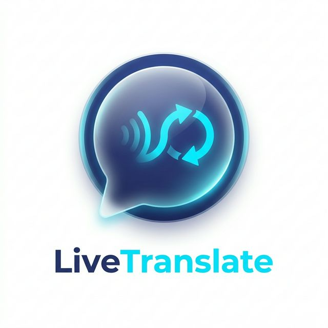
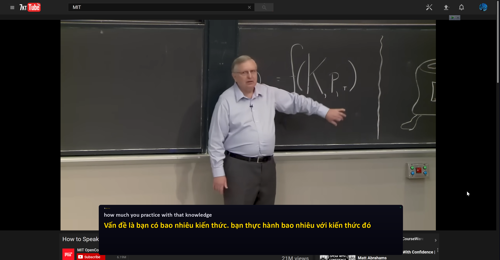
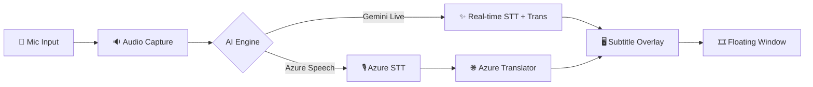

  

# 🎙️ LiveTranslate: Real-Time Speech Translation Overlay

**LiveTranslate** is a low-latency, real-time speech translation subtitle overlay for Windows. It captures your microphone audio, transcribes it using state-of-the-art AI, and provides instant translation in a sleek, semi-transparent floating window.

---

## 📥 Download & Quick Start

1.  **Download the Executable**: Go to [plan/release/](plan/release/) and download `LiveTranslate.exe`.
2.  **Launch**: Double-click the `.exe`. 
    - *Note: On first run, Windows might show a "SmartScreen" warning. Click "More info" -> "Run anyway".*
3.  **Configure**: Right-click the **LT** icon in the system tray -> **Settings** to enter your API keys.
4.  **Listen**: Right-click the tray icon -> **Start Listening**.
---

## 📺 Demo

---

## 🛠️ How It Works

LiveTranslate uses a modular pipeline to ensure the lowest possible latency between speech and subtitle display.

### The Pipeline:
1.  **Capture**: `PyAudio` captures raw 16kHz audio in 100ms chunks.
2.  **Processing**: 
    - **Google Gemini**: Uses the Gemini 2.0 Flash Live API (WebSocket) for simultaneous transcription and translation (lowest latency).
    - **Azure**: Uses Azure Cognitive Services for high-fidelity speech-to-text followed by neural translation.
3.  **Display**: A custom `PyQt5` window renders text with semi-transparency and "stay-on-top" priority.

---

## ✨ Key Features

-   **🚀 Near-Instant Translation**: Leverages **Google Gemini 2.0 Flash** or **Azure Speech Services** for real-time performance.
-   **🖥️ Non-Intrusive UI**:
    -   Semi-transparent overlay stays on top of meetings, videos, or games.
    -   Fully draggable and resizable (via settings).
    -   Interactive toggle: Double-click to instantly hide/show text.
-   **⌨️ Global Hotkey**: `Ctrl+Shift+L` to toggle listening from any application.
-   **📥 Tray-Based**: Operates entirely from the system tray for a clean, taskbar-free workspace.
-   **🎨 Customizable**: Change font size, colors, and window opacity to match your preference.

---

## 🧪 Technology Stack

-   **Frontend**: `PyQt5` for the high-performance transparent overlay and system tray management.
-   **Audio**: `PyAudio` for low-level microphone stream handling.
-   **AI Engines**:
    -   `google-genai`: WebSocket-based interaction with the Gemini Live API.
    -   `azure-cognitiveservices-speech`: Official SDK for Azure Speech-to-Text.
-   **Utilities**: `pystray` (tray icon), `keyboard` (global hotkeys), `python-dotenv` (config).

---

## 🛡️ Security & Privacy

-   **Local Processing**: Audio is streamed directly from your device to the AI provider. No data is stored on our servers.
-   **Secret Management**: Your API keys are stored locally in `config.json` and are never shared or uploaded.
-   **Open Source**: Audit the code yourself to see exactly how your data is handled.

---

## 📐 Promotion & Branding

Check out the [plan/](plan/) folder for high-resolution logos, marketing copy, and screenshots to help spread the word!

---

## 🤝 Contributing

Contributions are what make the open source community such an amazing place to learn, inspire, and create. Please see [CONTRIBUTING.md](CONTRIBUTING.md) for details.

---

## 📄 License

Distributed under the MIT License. See [LICENSE](LICENSE) for more information.

---

*Developed by **kotobuki09** with ❤️ and AI.*
